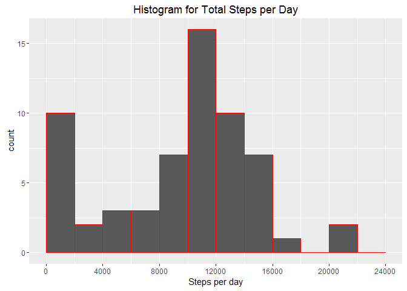
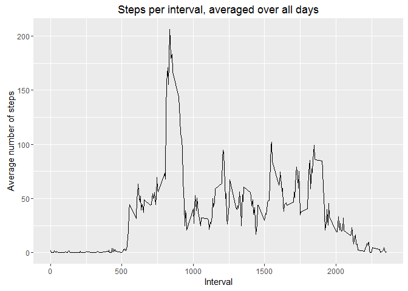
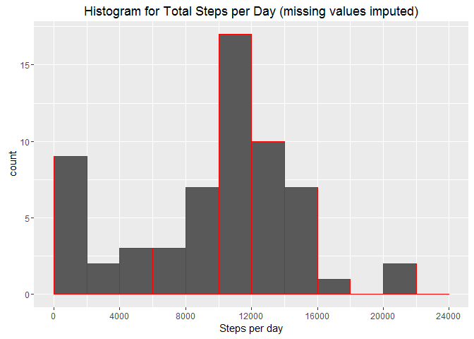
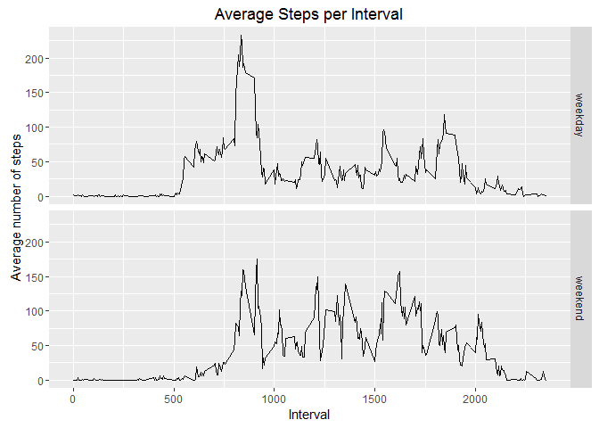

# Reproducible Research: Peer Assessment 1


```r
library(dplyr)
```

```
## 
## Attaching package: 'dplyr'
```

```
## The following objects are masked from 'package:stats':
## 
##     filter, lag
```

```
## The following objects are masked from 'package:base':
## 
##     intersect, setdiff, setequal, union
```

```r
library(ggplot2)

# Set global options

# Always display code in output
knitr::opts_chunk$set(echo = TRUE)
```

## Loading and preprocessing the data


```r
# Load the data 
actdata <- read.csv("activity.csv", sep = ",", header = TRUE)

# Process/transform the data into a format suitable for analysis
actdata$date <- as.Date(actdata$date)
```


## What is mean total number of steps taken per day?


```r
# Calculate total number of steps taken per day
# Ignore missing values
days <- group_by(actdata, date)
totals <- summarize(days, totalperday = sum(steps, na.rm=TRUE))

# Histogram of the total number of steps taken each day
ggplot(data = totals, aes(totals$totalperday)) +
    geom_histogram(breaks=seq(0, 24000, by=2000), col="red") +
    labs(title="Histogram for Total Steps per Day") +
    labs(x = "Steps per day") + 
    scale_x_continuous(limits=c(0, 24000), breaks=seq(0,24000,4000))
```

\

```r
# Calculate and report the mean and median 
# of the total number of steps taken per day

meanperday <- mean(totals$totalperday)
medianperday <- median(totals$totalperday)

cat("The mean of the total number of steps taken per day is ",  as.integer(meanperday), " steps.\n", sep = "")
```

```
## The mean of the total number of steps taken per day is 9354 steps.
```

```r
cat("The median of the total number of steps taken per day is ",  medianperday, " steps.\n", sep = "")
```

```
## The median of the total number of steps taken per day is 10395 steps.
```


## What is the average daily activity pattern?


```r
# Make a time series plot (i.e. type = "l") of the 5-minute interval (x-axis) and the average number of steps taken, averaged across all days (y-axis)

# Calculate steps per interval, averaged across all days
intervals <- group_by(actdata, interval)
avgintervals <- summarize(intervals, avg = mean(steps, na.rm=TRUE))

ggplot(avgintervals, aes(x = interval, y = avgintervals$avg)) +
    geom_line() +
    labs(x = "Interval", y = "Average number of steps") +
    labs(title="Steps per interval, averaged over all days") 
```

\

```r
# Which 5-minute interval, on average across all the days in the dataset, contains the maximum number of steps?

ind <- which(avgintervals$avg == max(avgintervals$avg))
maxinterval <- avgintervals$interval[ind]

cat("The 5-minute interval that contains the maximum number of steps, on average across all the days, is interval #",  maxinterval, ".\n", sep = "")
```

```
## The 5-minute interval that contains the maximum number of steps, on average across all the days, is interval #835.
```


## Imputing missing values


```r
# Calculate and report the total number of missing values in the dataset (i.e. the total number of rows with NAs)

numnas <- sum(is.na(actdata))
cat("The total number of missing values in the dataset is ",  numnas, ".\n", sep = "")
```

```
## The total number of missing values in the dataset is 2304.
```

```r
# Missing values are replaced with the mean for that 5-minute interval

# Create a new dataset that is equal to the original dataset but with the missing data filled in.

# Create new dataset equal to original dataset
data_imp <- actdata

# Indices of rows in original dataset with missing values
indna <- which(is.na(data_imp$steps)) 

# Indices of intervals corresponding to missing values
avgindices <- which(avgintervals$interval==data_imp$interval[indna])

# Replace missing values with the mean number of steps for that 5-minute interval
data_imp$steps[indna] <- avgintervals$avg[avgindices]
    
# Make a histogram of the total number of steps taken each day. Calculate and report the mean and median total number of steps taken per day. Do these values differ from the estimates from the first part of the assignment? What is the impact of imputing missing data on the estimates of the total daily number of steps?

# Calculate total number of steps taken per day
days_imp <- group_by(data_imp, date)
totals_imp <- summarize(days_imp, totalperday = sum(steps, na.rm=TRUE))

# Histogram of the total number of steps taken each day
ggplot(data = totals_imp, aes(totals_imp$totalperday)) +
    geom_histogram(breaks=seq(0, 24000, by=2000), col="red") +
    labs(title="Histogram for Total Steps per Day (missing values imputed)") +
    labs(x = "Steps per day") + 
    scale_x_continuous(limits=c(0, 24000), breaks=seq(0,24000,4000))
```

\

```r
# Calculate and report the mean and median 
# of the total number of steps taken per day

meanperday_imp <- mean(totals_imp$totalperday)
medianperday_imp <- median(totals_imp$totalperday)

cat("After imputing missing data, the mean of the total number of steps taken per day is ",  as.integer(meanperday_imp), " steps.\n", sep = "")
```

```
## After imputing missing data, the mean of the total number of steps taken per day is 9530 steps.
```

```r
cat("After imputing missing data, the median of the total number of steps taken per day is ",  medianperday_imp, " steps.\n", sep = "")
```

```
## After imputing missing data, the median of the total number of steps taken per day is 10439 steps.
```


The effect of imputing missing data is to increase the total number of steps per day.


## Are there differences in activity patterns between weekdays and weekends?


```r
# Create a new factor variable in the dataset with two levels - "weekday" and "weekend" indicating whether a given date is a weekday or weekend day.

data_imp2 <- mutate(data_imp, wday = weekdays(data_imp$date))

data_imp2$wday[which(data_imp2$wday=="Sunday" | data_imp2$wday=="Saturday")] <- "weekend"

data_imp2$wday[which(data_imp2$wday!="weekend")] <- "weekday"

data_imp2$wday <- factor(data_imp2$wday)

# Make a panel plot containing a time series plot (i.e. type = "l") of the 5-minute interval (x-axis) and the average number of steps taken, averaged across all weekday days or weekend days (y-axis). 

# Calculate steps per interval, averaged across all days
wdaygroups <- group_by(data_imp2, interval, wday)
avgwdays <- summarize(wdaygroups, avg = mean(steps, na.rm=TRUE))

ggplot(avgwdays, aes(x = interval, y = avg)) +
    geom_line() +
    labs(x = "Interval", y = "Average number of steps") +
    labs(title="Average Steps per Interval") +
    facet_grid(wday ~ .)
```

\
